# Spring Boot Kafka Microservices

    Estudos e Pesquisas do João Caboclo da S. Filho
    Adicionei esta documentação para ajudar na compreensão e desenvolvimento do projeto
    Espero que te ajude a evoluir, assim como ajudou-me!!!!
    Setembro de 2023 - Uberlândia/Minas gerais/Brasil

    Vídeo aula base do aprendizado: https://www.youtube.com/playlist?list=PLGRDMO4rOGcOlnu6QhogZDNFFwiwKh5X9

    

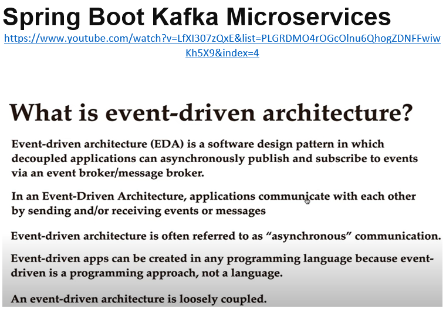

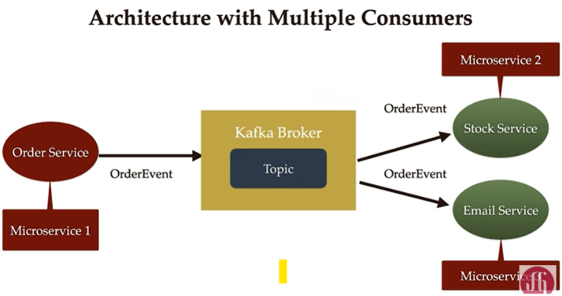

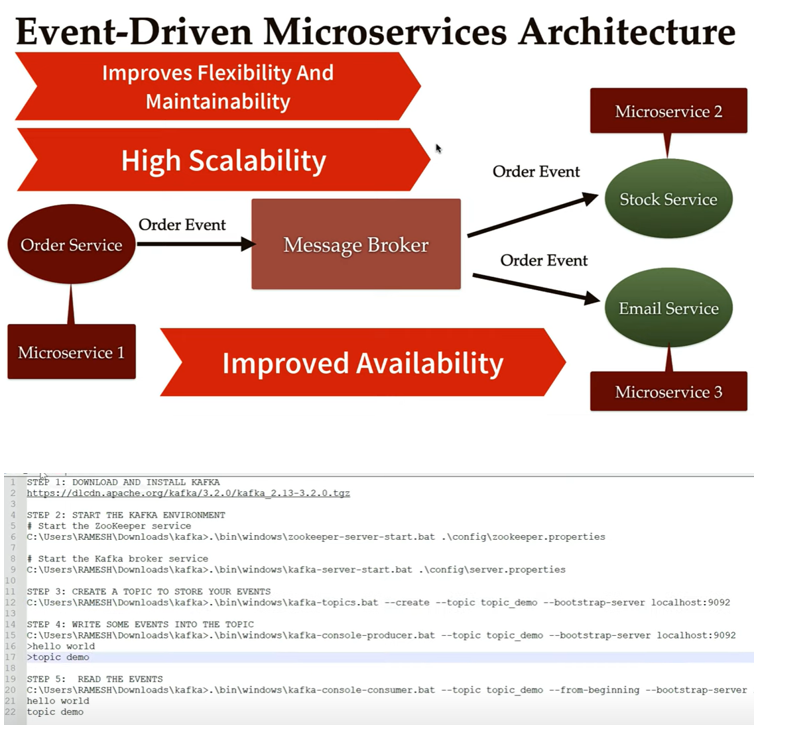

Baixar o KAFKA
    https://www.apache.org/dyn/closer.cgi?path=/kafka/3.5.0/kafka_2.13-3.5.0.tgz
    Renomear o arquivo baixado: kafka_2.13-3.5.0.tgz para kafka.tgz 
    Copair para dentro de uma pasta especifica e descompactar.
    No meu caso, copiei em C:\Users\joao.filho\kafka

Rodar o ZooKeeper

    Estando na pasta: C:\Users\joao.filho\kafka
       .\bin\windows\zookeeper-server-start.bat .\config\zookeeper.properties

    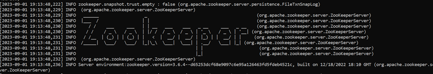
Rodando o KAFKA
    C:\Users\joao.filho\kafka>
        .\bin\windows\kafka-server-start.bat .\config\server.properties

    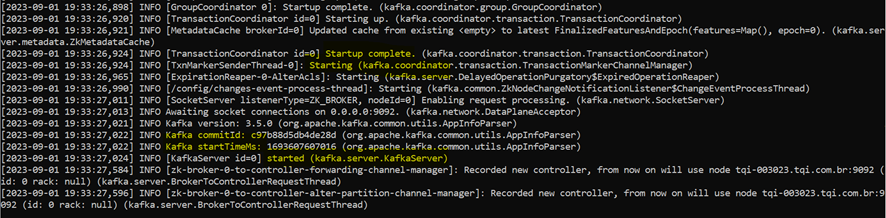

Criando um Tópico
    C:\Users\joao.filho\kafka>
        .\bin\windows\kafka-topics.bat –create –topic topic-jcab1 
            –bootstrap-server localhost:9092

    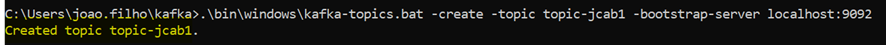

Enviando Mensagem para o Tópico
    C:\Users\joao.filho\kafka>
        .\bin\windows\kafka-console-producer.bat  –topic topic-jcab1 
              –bootstrap-server localhost:9092

    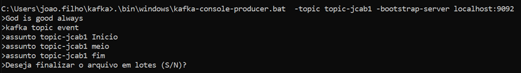

Lendo as Mensagem do Tópico

    C:\Users\joao.filho\kafka>
        .\bin\windows\kafka-console-consumer.bat  –topic topic-jcab1 
            –from-beginning –bootstrap-server localhost:9092

    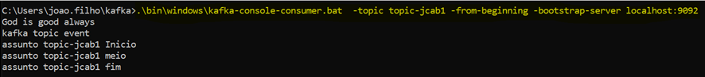

Baixando a IDE para gerenciar os Tópicos - KAFKADROP
    
        curl -LO https://github.com/obsidiandynamics/kafdrop/releases/download/3.30.0/kafdrop-3.30.0.jar

    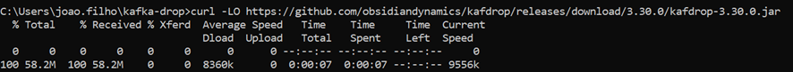

    Altere o nome de kafdrop-3.30.0.jar para kafdrop.jar

Executando a IDE para gerenciar os Tópicos - KAFKADROP
    C:\Users\joao.filho\kafka-drop
        java -jar kafkadrop.jar -kafka.brokerConnect=localhost:9092

Consultando o browse da IDE para gerenciar os Tópicos - KAFKADROP
    http://localhost:9000/

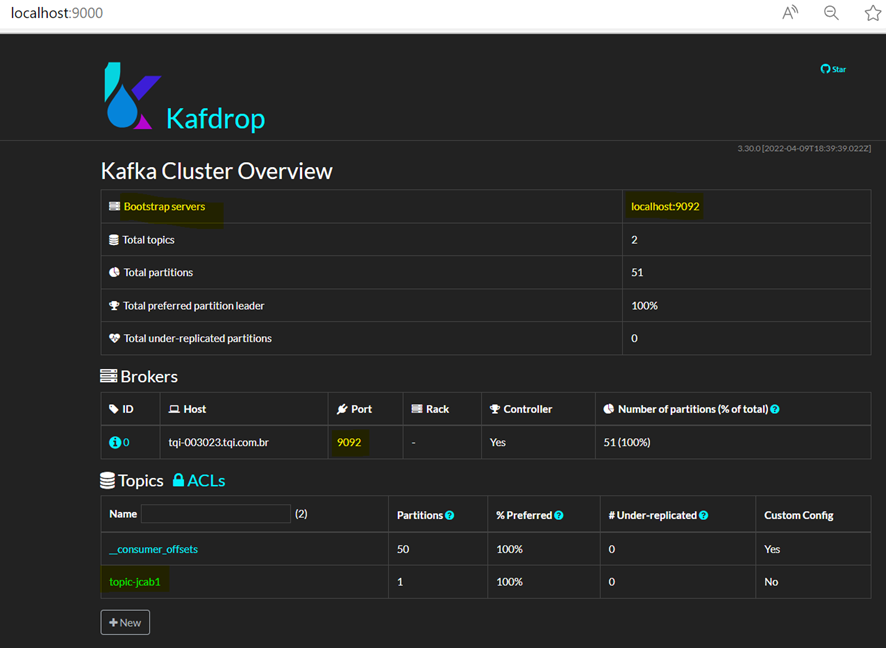

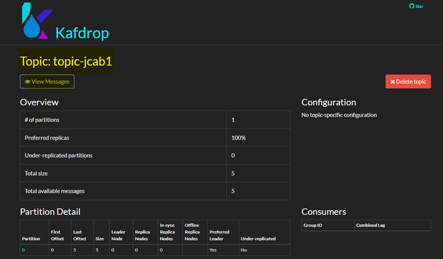

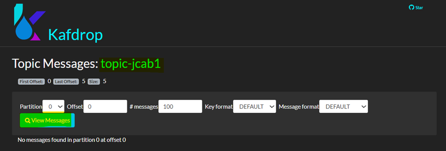

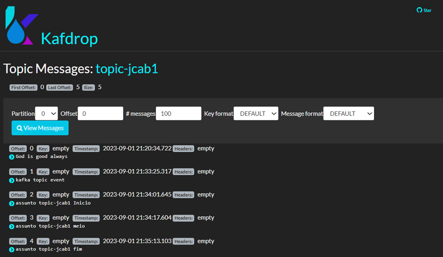

O PROJETO SPRING BOOT

    Spring Boot Kafka Microservices Create os Microservices
    
    Spring Initializr
          https://start.spring.io/

    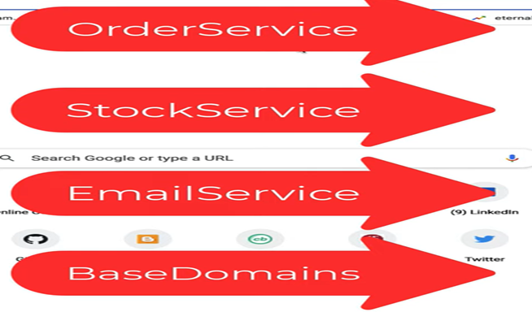

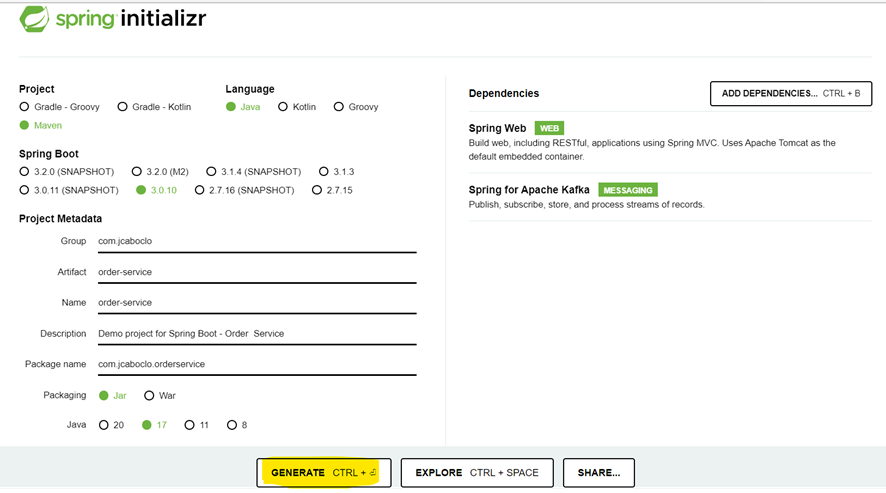

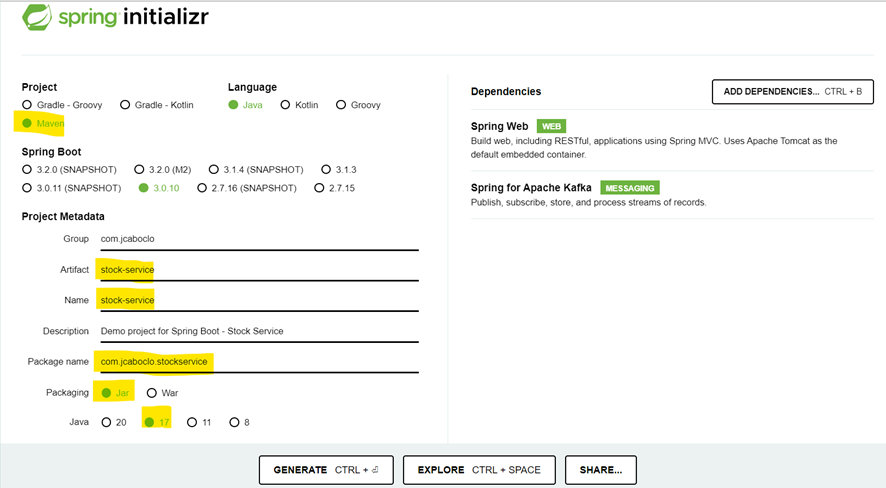

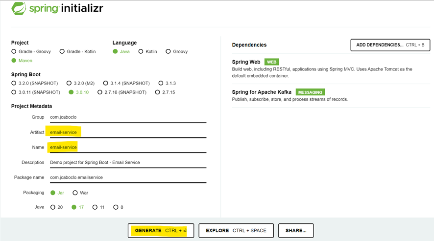

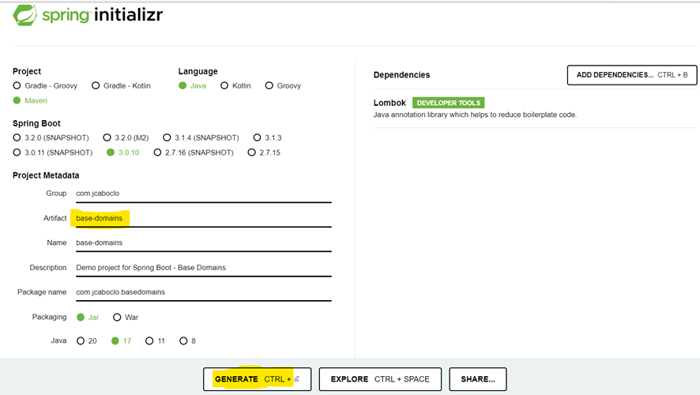

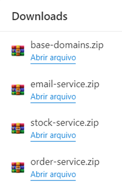

Criar uma pasta e copiar todos os micros serviços, já descompactados para dentro desta pasta

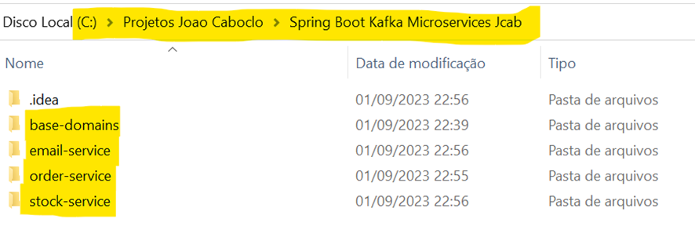

ABRINDO OS MICROS SERVIÇOS

    Abrir o intellij, ir na opção OPEN e selecionar a pasta que está com os 4 micros serviços
    Alterar a porta de execução dos micros serviços, no arquivo application. properties
    Exceto o base-domais... o order-service irá rodar na porta padrão 8080
    
    Os Micros serviços rodando (exceto o base-domains )

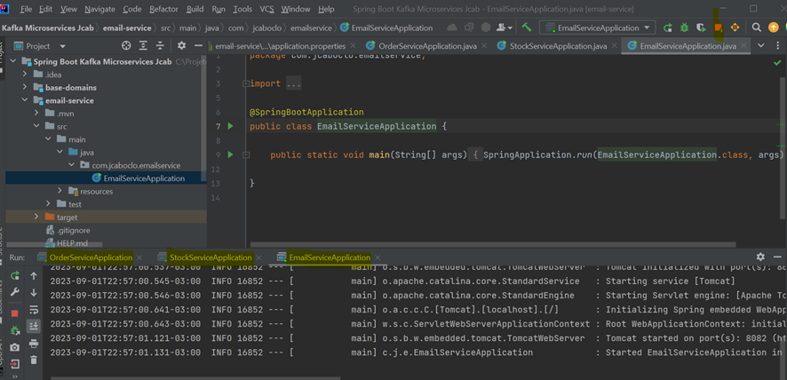

BASE-DOMAINS

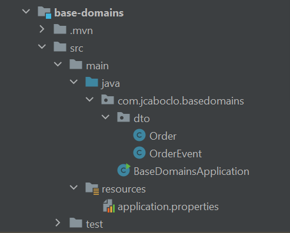

Order 
    package com.jcaboclo.basedomains.dto;
    
    import lombok.AllArgsConstructor;
    import lombok.Data;
    import lombok.NoArgsConstructor;
    
    @Data
    @AllArgsConstructor
    @NoArgsConstructor
    public class Order {
        private String orderId;
        private String name;
        private int qty;
        private double price;
    }

OrderEvent

    package com.jcaboclo.basedomains.dto;
    
    import lombok.AllArgsConstructor;
    import lombok.Data;
    import lombok.NoArgsConstructor;
    
    @Data
    @AllArgsConstructor
    @NoArgsConstructor
    public class OrderEvent {
    
        private String message;
        private String status;
        private Order order;
    
    }

ORDER-SERVICE 

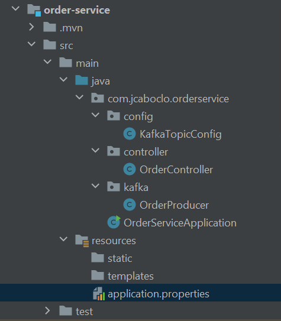

O POM.XML
   Registrará a dependencia do micro serviço base-domains

       <dependency>
            <groupId>com.jcaboclo</groupId>
            <artifactId>base-domains</artifactId>
            <version>0.0.1-SNAPSHOT</version>
            <scope>compile</scope>
       </dependency>

    CONFIGURANDO O PRODUCER NO APPLICATION.PROPERTIES do 

    spring.kafka.producer.bootstrap-servers=localhost:9092
    spring.kafka.producer.key-serializer=org.apache.kafka.common.serialization.StringSerializer
    spring.kafka.producer.value-serializer=org.springframework.kafka.support.serializer.JsonSerializer
    spring.kafka.topic.name=order_topics

KafkaTopicConfig

    package com.jcaboclo.orderservice.config;
    import org.apache.kafka.clients.admin.NewTopic;
    import org.springframework.beans.factory.annotation.Value;
    import org.springframework.context.annotation.Bean;
    import org.springframework.context.annotation.Configuration;
    import org.springframework.kafka.config.TopicBuilder;
    
    @Configuration
    public class KafkaTopicConfig {
       
        @Value("${spring.kafka.topic.name}")
        private String topicName;
        
        //spring bean for kafka topic
        @Bean
        public NewTopic topic() {
           return TopicBuilder.name(topicName)
           .build();
        }
    }

OrderProducer

    package com.jcaboclo.orderservice.kafka;
    
    import com.jcaboclo.basedomains.dto.OrderEvent;
    import org.apache.kafka.clients.admin.NewTopic;
    import org.slf4j.Logger;
    import org.slf4j.LoggerFactory;
    import org.springframework.kafka.core.KafkaTemplate;
    import org.springframework.kafka.support.KafkaHeaders;
    import org.springframework.messaging.Message;
    import org.springframework.messaging.support.MessageBuilder;
    import org.springframework.stereotype.Service;
    
    @Service
    public class OrderProducer {
    
        private static final Logger LOGGER = LoggerFactory.getLogger(OrderProducer.class);
    
        private NewTopic topic;
        private KafkaTemplate<String, OrderEvent> kafkaTemplate;
    
        public OrderProducer(NewTopic topic, KafkaTemplate<String, OrderEvent> kafkaTemplate) {
            this.topic = topic;
            this.kafkaTemplate = kafkaTemplate;
        }
    
        public void sendMessage(OrderEvent event) {
    
            LOGGER.info(String.format("Order event ==> %s", event.toString()));
    
            Message<OrderEvent> message = MessageBuilder
                    .withPayload(event)
                    .setHeader(KafkaHeaders.TOPIC, topic.name())
                    .build();
    
            kafkaTemplate.send(message);
    
        }
    }

OrderController

    package com.jcaboclo.orderservice.controller;
    
    import com.jcaboclo.basedomains.dto.Order;
    import com.jcaboclo.basedomains.dto.OrderEvent;
    import com.jcaboclo.orderservice.kafka.OrderProducer;
    import org.springframework.web.bind.annotation.PostMapping;
    import org.springframework.web.bind.annotation.RequestBody;
    import org.springframework.web.bind.annotation.RequestMapping;
    import org.springframework.web.bind.annotation.RestController;
    import java.util.UUID;
    
    @RestController
    @RequestMapping("/api/v1")
    public class OrderController {
    
        private OrderProducer OrderProducer;
        public OrderController(com.jcaboclo.orderservice.kafka.OrderProducer orderProducer) {
            OrderProducer = orderProducer;
        }
    
        @PostMapping("/orders")
        public String placeOrder(@RequestBody Order order) {
    
            order.setOrderId(UUID.randomUUID().toString());
            OrderEvent orderEvent = new OrderEvent();
            orderEvent.setStatus("PENDING");
            orderEvent.setMessage("Order status is in pending state");
            orderEvent.setOrder(order);
    
            OrderProducer.sendMessage(orderEvent);
    
            return "Order placed successfully....";
    
        }
    
    }

Testando pelo POSTMAN

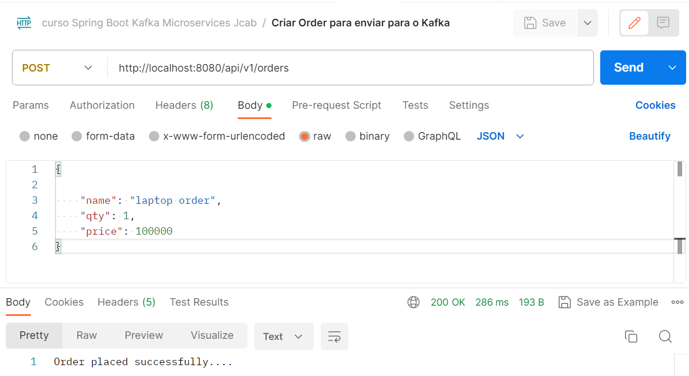

O LOG REGISTRANDO A AÇÃO
  2023-09-02T09:39:10.333-03:00  INFO 2908 --- [nio-8080-exec-2]
     c.j.orderservice.kafka.OrderProducer     :
         Order event ==> OrderEvent(message=Order status is in pending state, 
                                    status=PENDING, 
                                    order=Order(orderId=f60f5697-272d-4f4f-9d9f-f59907cca717, 
                                                name=laptop order, 
                                                qty=1, 
                                                price=100000.0))
O servidor KAFKA rodando em
   bootstrap.servers = [localhost:9092]

As classes de serialização usada no application.properties
    key.serializer = class org.apache.kafka.common.serialization.StringSerializer
    value.serializer = class org.springframework.kafka.support.serializer.JsonSerializer

Consultando no KAFKADROP

http://localhost:9000/

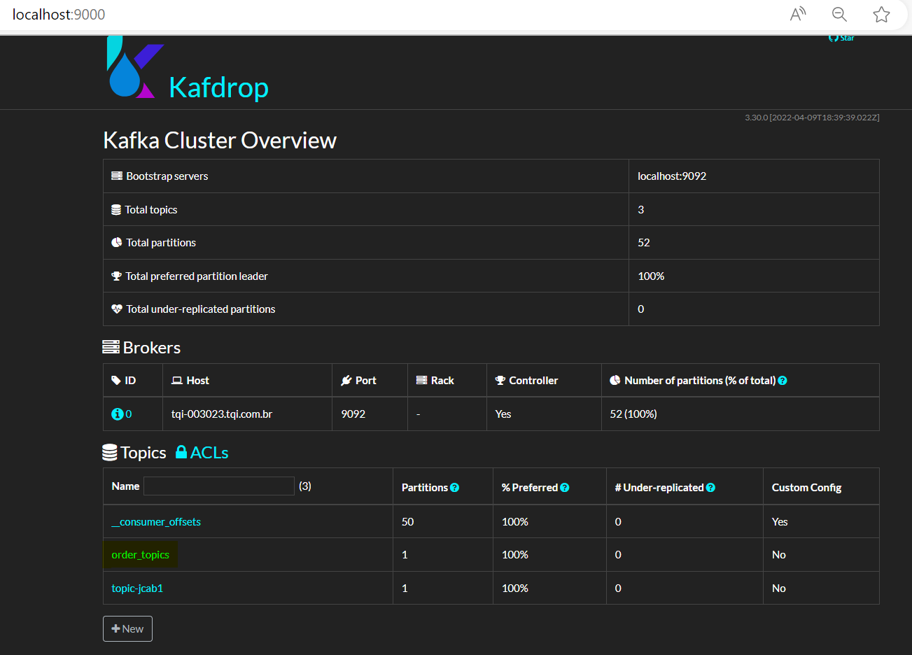

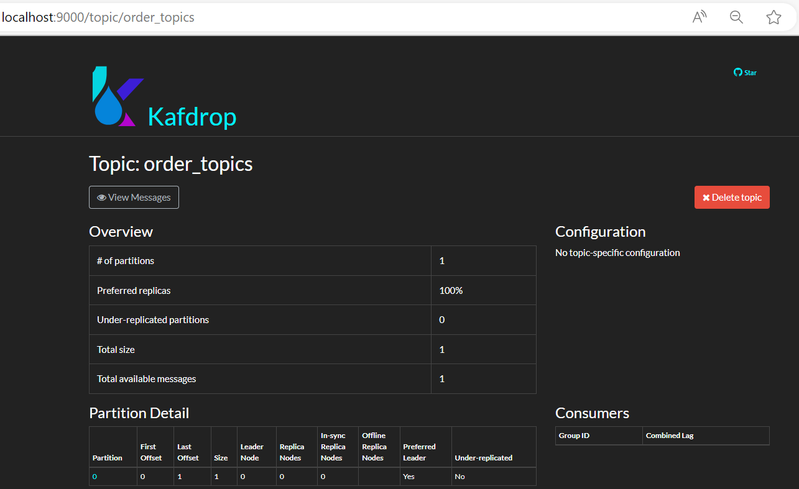

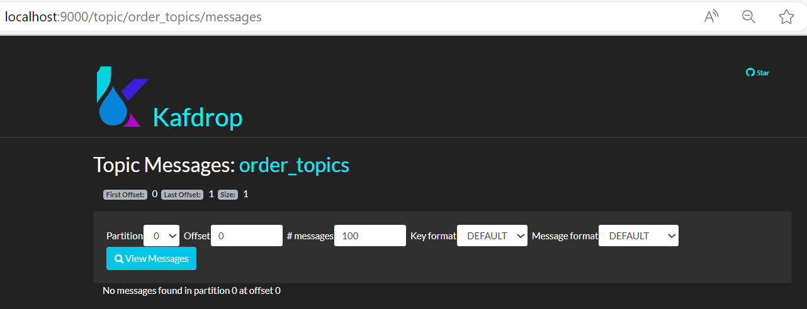

http://localhost:9000/topic/order_topics/messages?partition=0&offset=0&count=100&keyFormat=DEFAULT&format=DEFAULT

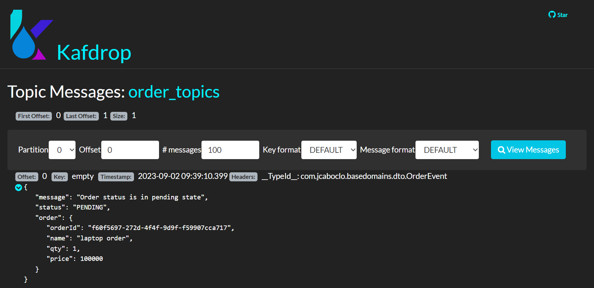

    

