# Spring Boot Kafka Microservices

    Estudos e Pesquisas do João Caboclo da S. Filho

    Adorei este trabalho!!  -  
    Com certeza irá ajudar muitos!  -  
    Dúvidas: johncaboclo@gmail.com, ou me chama pelo linkedin mesmo.

    Adicionei esta documentação para ajudar na compreensão e desenvolvimento do projeto
    Espero que te ajude a evoluir, assim como ajudou-me!!!!
    Setembro de 2023 - Uberlândia/Minas gerais/Brasil

    Vídeo aula base do aprendizado: https://www.youtube.com/playlist?list=PLGRDMO4rOGcOlnu6QhogZDNFFwiwKh5X9

    

**Baixar o KAFKA**
    https://www.apache.org/dyn/closer.cgi?path=/kafka/3.5.0/kafka_2.13-3.5.0.tgz
    Renomear o arquivo baixado: kafka_2.13-3.5.0.tgz para kafka.tgz 
    Copair para dentro de uma pasta especifica e descompactar.
    No meu caso, copiei em C:\Users\joao.filho\kafka

**Rodar o ZooKeeper**

    Estando na pasta: C:\Users\joao.filho\kafka
       .\bin\windows\zookeeper-server-start.bat .\config\zookeeper.properties

    
**Rodando o KAFKA**
    C:\Users\joao.filho\kafka>
        .\bin\windows\kafka-server-start.bat .\config\server.properties

    

**Criando um Tópico**
    C:\Users\joao.filho\kafka>
        .\bin\windows\kafka-topics.bat –create –topic topic-jcab1 
            –bootstrap-server localhost:9092

    

**Enviando Mensagem para o Tópico**
    C:\Users\joao.filho\kafka>
        .\bin\windows\kafka-console-producer.bat  –topic topic-jcab1 
              –bootstrap-server localhost:9092

    

**Lendo as Mensagem do Tópico**

    C:\Users\joao.filho\kafka>
        .\bin\windows\kafka-console-consumer.bat  –topic topic-jcab1 
            –from-beginning –bootstrap-server localhost:9092

    

**Baixando a IDE para gerenciar os Tópicos - KAFKADROP**
    
        curl -LO https://github.com/obsidiandynamics/kafdrop/releases/download/3.30.0/kafdrop-3.30.0.jar

    

    Altere o nome de kafdrop-3.30.0.jar para kafdrop.jar

**Executando a IDE para gerenciar os Tópicos - KAFKADROP**
    C:\Users\joao.filho\kafka-drop
        java -jar kafkadrop.jar -kafka.brokerConnect=localhost:9092

**Consultando o browse da IDE para gerenciar os Tópicos - KAFKADROP**
    http://localhost:9000/

**O PROJETO SPRING BOOT**

    Spring Boot Kafka Microservices Create os Microservices
    
    Spring Initializr
          https://start.spring.io/

    

    Criar uma pasta e copiar todos os micros serviços, já descompactados para dentro desta pasta

**ABRINDO OS MICROS SERVIÇOS**

    Abrir o intellij, ir na opção OPEN e selecionar a pasta que está com os 4 micros serviços
    Alterar a porta de execução dos micros serviços, no arquivo application. properties
    Exceto o base-domais... o order-service irá rodar na porta padrão 8080
    
    Os Micros serviços rodando (exceto o base-domains )

BASE-DOMAINS

**BASE-DOMAINS - Configurando as classes básicas**

    class Order

    package com.jcaboclo.basedomains.dto;
    
    import lombok.AllArgsConstructor;
    import lombok.Data;
    import lombok.NoArgsConstructor;
    
    @Data
    @AllArgsConstructor
    @NoArgsConstructor
    public class Order {
        private String orderId;
        private String name;
        private int qty;
        private double price;
    }

    class OrderEvent

    package com.jcaboclo.basedomains.dto;
    
    import lombok.AllArgsConstructor;
    import lombok.Data;
    import lombok.NoArgsConstructor;
    
    @Data
    @AllArgsConstructor
    @NoArgsConstructor
    public class OrderEvent {
    
        private String message;
        private String status;
        private Order order;
    
    }

**SERVIÇO: ORDER-SERVICE** 

**O POM.XML**
   Registrará a dependencia do micro serviço base-domains

       <dependency>
            <groupId>com.jcaboclo</groupId>
            <artifactId>base-domains</artifactId>
            <version>0.0.1-SNAPSHOT</version>
            <scope>compile</scope>
       </dependency>

**CONFIGURANDO O PRODUCER NO APPLICATION.PROPERTIES** 

    spring.kafka.producer.bootstrap-servers=localhost:9092
    spring.kafka.producer.key-serializer=org.apache.kafka.common.serialization.StringSerializer
    spring.kafka.producer.value-serializer=org.springframework.kafka.support.serializer.JsonSerializer
    spring.kafka.topic.name=order_topics

**A Class KafkaTopicConfig**

    package com.jcaboclo.orderservice.config;
    import org.apache.kafka.clients.admin.NewTopic;
    import org.springframework.beans.factory.annotation.Value;
    import org.springframework.context.annotation.Bean;
    import org.springframework.context.annotation.Configuration;
    import org.springframework.kafka.config.TopicBuilder;
    
    @Configuration
    public class KafkaTopicConfig {
       
        @Value("${spring.kafka.topic.name}")
        private String topicName;
        
        //spring bean for kafka topic
        @Bean
        public NewTopic topic() {
           return TopicBuilder.name(topicName)
           .build();
        }
    }

**A class OrderProducer**

    package com.jcaboclo.orderservice.kafka;
    
    import com.jcaboclo.basedomains.dto.OrderEvent;
    import org.apache.kafka.clients.admin.NewTopic;
    import org.slf4j.Logger;
    import org.slf4j.LoggerFactory;
    import org.springframework.kafka.core.KafkaTemplate;
    import org.springframework.kafka.support.KafkaHeaders;
    import org.springframework.messaging.Message;
    import org.springframework.messaging.support.MessageBuilder;
    import org.springframework.stereotype.Service;
    
    @Service
    public class OrderProducer {
    
        private static final Logger LOGGER = LoggerFactory.getLogger(OrderProducer.class);
    
        private NewTopic topic;
        private KafkaTemplate<String, OrderEvent> kafkaTemplate;
    
        public OrderProducer(NewTopic topic, KafkaTemplate<String, OrderEvent> kafkaTemplate) {
            this.topic = topic;
            this.kafkaTemplate = kafkaTemplate;
        }
    
        public void sendMessage(OrderEvent event) {
    
            LOGGER.info(String.format("Order event ==> %s", event.toString()));
    
            Message<OrderEvent> message = MessageBuilder
                    .withPayload(event)
                    .setHeader(KafkaHeaders.TOPIC, topic.name())
                    .build();
    
            kafkaTemplate.send(message);
    
        }
    }

**A Class OrderController**

    package com.jcaboclo.orderservice.controller;
    
    import com.jcaboclo.basedomains.dto.Order;
    import com.jcaboclo.basedomains.dto.OrderEvent;
    import com.jcaboclo.orderservice.kafka.OrderProducer;
    import org.springframework.web.bind.annotation.PostMapping;
    import org.springframework.web.bind.annotation.RequestBody;
    import org.springframework.web.bind.annotation.RequestMapping;
    import org.springframework.web.bind.annotation.RestController;
    import java.util.UUID;
    
    @RestController
    @RequestMapping("/api/v1")
    public class OrderController {
    
        private OrderProducer OrderProducer;
        public OrderController(com.jcaboclo.orderservice.kafka.OrderProducer orderProducer) {
            OrderProducer = orderProducer;
        }
    
        @PostMapping("/orders")
        public String placeOrder(@RequestBody Order order) {
    
            order.setOrderId(UUID.randomUUID().toString());
            OrderEvent orderEvent = new OrderEvent();
            orderEvent.setStatus("PENDING");
            orderEvent.setMessage("Order status is in pending state");
            orderEvent.setOrder(order);
    
            OrderProducer.sendMessage(orderEvent);
    
            return "Order placed successfully....";
    
        }
    
    }

**Testando pelo POSTMAN**

**O LOG REGISTRANDO A AÇÃO no intellij**

  2023-09-02T09:39:10.333-03:00  INFO 2908 --- [nio-8080-exec-2]
     c.j.orderservice.kafka.OrderProducer     :
         Order event ==> OrderEvent(message=Order status is in pending state, 
                                    status=PENDING, 
                                    order=Order(orderId=f60f5697-272d-4f4f-9d9f-f59907cca717, 
                                                name=laptop order, 
                                                qty=1, 
                                                price=100000.0))
O servidor KAFKA rodando em
   bootstrap.servers = [localhost:9092]

As classes de serialização usada no application.properties
    key.serializer = class org.apache.kafka.common.serialization.StringSerializer
    value.serializer = class org.springframework.kafka.support.serializer.JsonSerializer

**Consultando no KAFKADROP**

http://localhost:9000/

http://localhost:9000/topic/order_topics/messages?partition=0&offset=0&count=100&keyFormat=DEFAULT&format=DEFAULT

## Agora iremos configurar o KAFKA CONSUMER no micro serviço Stock-Service

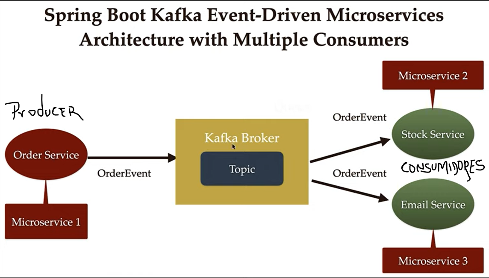

Vários consumidores

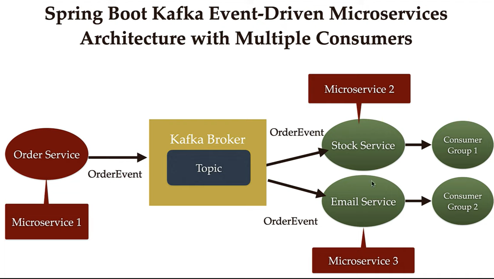

**Configurando o CONSUMER no arquivo application.properties do micro serviço stock-service**

    server.port=8081
    
    ## Esta propriedade indica que este consumidor ficará escutando/atento
    ## a qualquer mensagem/evento que chegar no kafka que está rodando na porta 9092
    spring.kafka.consumer.bootstrap-servers: localhost:9092
    
    ## Nome do grupo é importante para o caso de termos vários consumidores buscando do mesmo tópico
    spring.kafka.consumer.group-id: stock
    
    ##  Configurando a deserialização do objeto para JSON
    spring.kafka.consumer.auto-offset-reset: earliest
    spring.kafka.consumer.key-deserializer: org.apache.kafka.common.serialization.StringDeserializer
    spring.kafka.consumer.value-deserializer: org.springframework.kafka.support.serializer.JsonDeserializer
    spring.kafka.consumer.properties.spring.json.trusted.packages=*
    
    ## tem que ser o mesmo nome do tópico que foi definido lá no Produtor ( micro serviço order-service )
    spring.kafka.topic.name=order_topics

**Lembrando que para rodar os micros serviços é preciso que os serviços abaixo esteja rodando**
    
    C:\Users\joao.filho\kafka
    ZooKeeper 
         comando:  .\bin\windows\zookeeper-server-start.bat .\config\zookeeper.properties
    Kafka
         comando:  .\bin\windows\kafka-server-start.bat .\config\server.properties

    Para consultar/gerenciar os  tópicos no kafka - rodar também o kafkadrop 
       C:\Users\joao.filho\kafka-drop
         comando: java -jar kafkadrop.jar -kafka.brokerConnect=localhost:9092

**Executando o micro serviço stock-service após configurarmos o consumer 
       lá no arquivo application.properties**

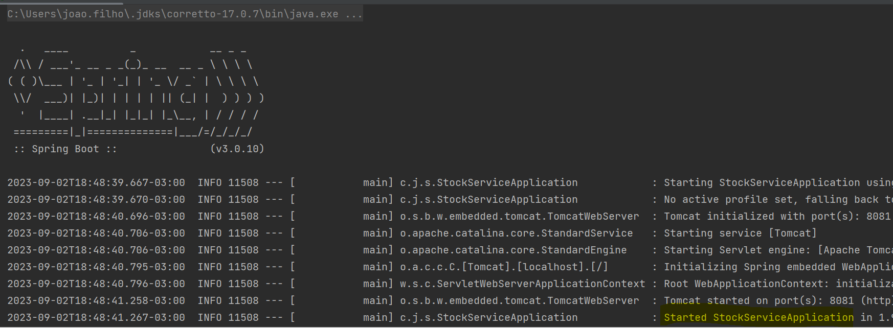

**Estruta do micro serviço stock-service**

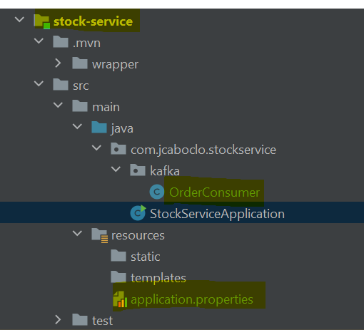

**Criando a class consumer**

    package com.jcaboclo.stockservice.kafka;
    
    import com.jcaboclo.basedomains.dto.OrderEvent;
    import org.slf4j.Logger;
    import org.slf4j.LoggerFactory;
    import org.springframework.kafka.annotation.KafkaListener;
    import org.springframework.stereotype.Service;

    @Service
    public class OrderConsumer {
        private static final Logger LOGGER = LoggerFactory.getLogger(OrderConsumer.class);
   
        @KafkaListener(
           topics = "${spring.kafka.topic.name}",
           groupId = "${spring.kafka.consumer.group-id}"
        )
        public void consume(OrderEvent event) {
 
           LOGGER.info(String.format("Order event received in stock-service ==> %s", event.toString()));
    
          // todo
          //   Save the order event into the database
        }
    }

**Ao executar o micro serviço, verifique o log no intellij**

2023-09-02T19:25:48.565-03:00  INFO 8604 --- [ntainer#0-0-C-1] 
    c.j.stockservice.kafka.OrderConsumer     : **Order event received in stock-service** 
      ==> OrderEvent(message=Order status is in pending state, 
          status=PENDING, order=Order(orderId=f60f5697-272d-4f4f-9d9f-f59907cca717, 
                                      name=laptop order, 
                                      qty=1, 
                                      price=100000.0))

**Agora, tendo o order-service e o stock-service em execução, vamos fazer um teste 
enviando um um order service event pelo Postman**

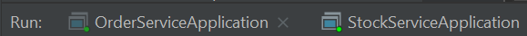

**Executando o teste pelo POSTMAN**

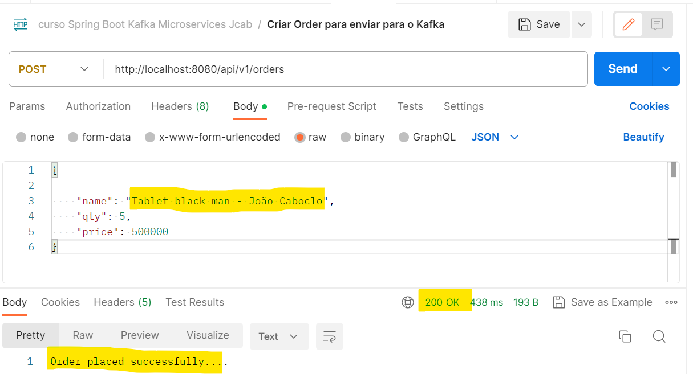

**Consultando no Log do Intelij**

    No PRODUCER ORDER-SERVICE

    2023-09-02T19:51:19.377-03:00  INFO 17244 --- [nio-8080-exec-2]
       c.j.orderservice.kafka.OrderProducer     : 
       Order event ==> OrderEvent(message=Order status is in pending state, 
            status=PENDING, order=Order(orderId=a677a795-d3a2-4d66-8ec5-c4c2be79208c, 
            name=Tablet black man - João Caboclo, qty=5, price=500000.0))

    No CONSUMER STOCK-SERVICE
    
    2023-09-02T19:51:19.685-03:00  INFO 3804 --- [ntainer#0-0-C-1] 
       c.j.stockservice.kafka.OrderConsumer     : Order event received in stock-service ==>
           OrderEvent(message=Order status is in pending state, status=PENDING, 
           order=Order(orderId=a677a795-d3a2-4d66-8ec5-c4c2be79208c, 
           name=Tablet black man - João Caboclo, qty=5, price=500000.0))

**Consultando no KAFKADROP**
     http://localhost:9000/

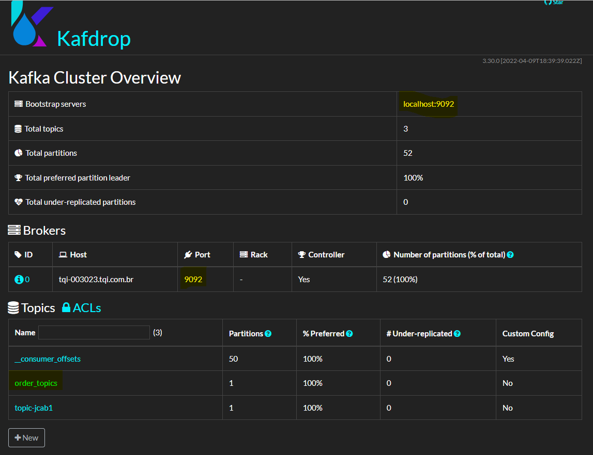

     http://localhost:9000/topic/order_topics
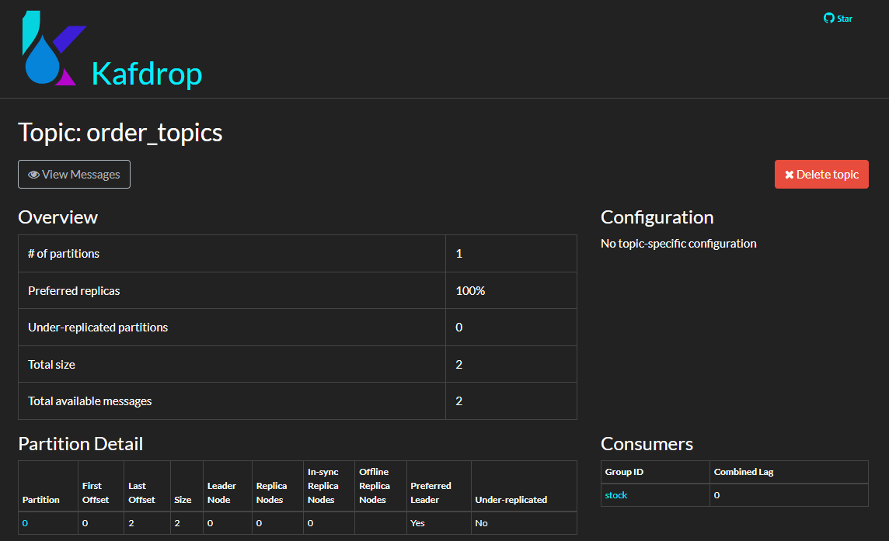

http://localhost:9000/topic/order_topics/messages?partition=0&offset=0&count=100&keyFormat=DEFAULT&format=DEFAULT

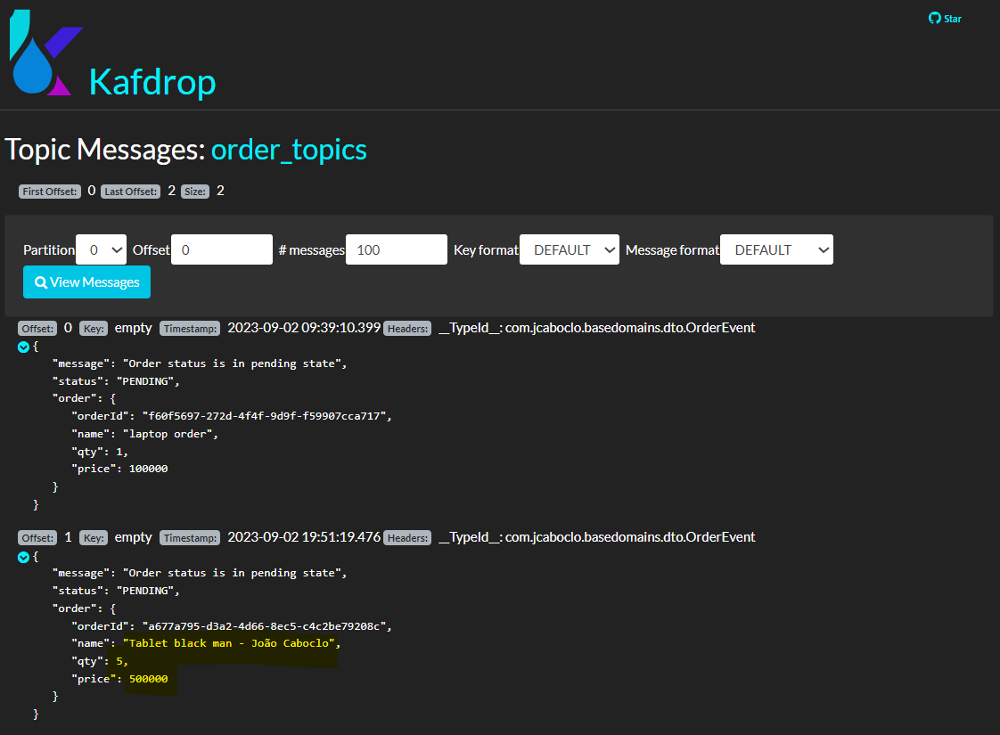

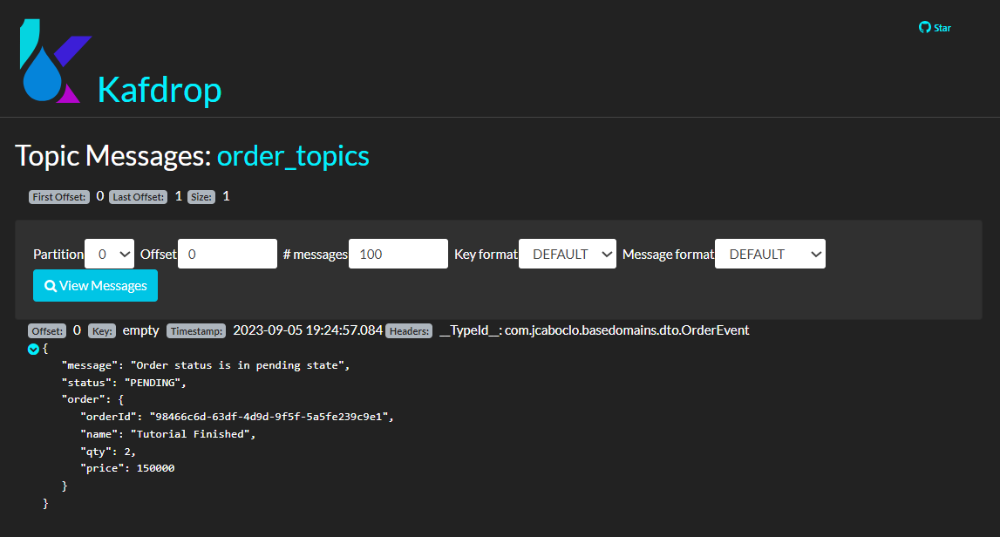

## Configurando o DOCKER-COMPOSE

       A finalidade é carregar o ZOOKEEPER, O KAFKA E O KAFKADROP sem ser por linha de comando.
       A pasta ficará fora de qualquer micro serviço. conforme ficura abaixo

**A configuração do docker-compose.yml**

        version: "3.0"
        
        services:
        
        zookeeper:
        image: confluentinc/cp-zookeeper:5.1.2
        restart: always
        environment:
        ZOOKEEPER_SERVER_ID: 1
        ZOOKEEPER_CLIENT_PORT: "2181"
        ZOOKEEPER_TICK_TIME: "2000"
        ZOOKEEPER_SERVERS: "zookeeper:22888:23888"
        ports:
        - "2181:2181"
        
        kafka1:
        image: confluentinc/cp-enterprise-kafka:5.1.2
        depends_on:
        - zookeeper
        ports:
          - "29092:29092"
          environment:
          KAFKA_ZOOKEEPER_CONNECT: "zookeeper:2181"
          KAFKA_LISTENER_SECURITY_PROTOCOL_MAP: PLAINTEXT:PLAINTEXT,PLAINTEXT_HOST:PLAINTEXT
          KAFKA_INTER_BROKER_LISTENER_NAME: PLAINTEXT
          KAFKA_ADVERTISED_LISTENERS: PLAINTEXT://kafka1:9092,PLAINTEXT_HOST://localhost:29092
          KAFKA_ADVERTISED_HOST_NAME: kafka1
          KAFKA_BROKER_ID: 1
          KAFKA_BROKER_RACK: "r1"
          KAFKA_OFFSETS_TOPIC_REPLICATION_FACTOR: 1
          KAFKA_DELETE_TOPIC_ENABLE: "true"
          KAFKA_AUTO_CREATE_TOPICS_ENABLE: "true"
          KAFKA_SCHEMA_REGISTRY_URL: "schemaregistry:8085"
          KAFKA_JMX_PORT: 9991
          kafdrop:
          image: obsidiandynamics/kafdrop
          restart: "no"
          ports:
          - "9000:9000"
          environment:
          KAFKA_BROKERCONNECT: "kafka1:29092"
          depends_on:
          - kafka1

      Obs:  Em algumas images a porta em que o kafka está rodando esta cobfigurado como:
      
      spring.kafka.consumer.bootstrap-servers: localhost:9092

      mas precisei alterar nos fontes para:
         spring.kafka.consumer.bootstrap-servers: localhost:29092
   
      ou seja: mudou de 9092 para 29092 - nos fontes já esta atualizado

    Para rodar este arquivo você precisará ter o docker desktop instalado
       https://docs.docker.com/compose/install/

  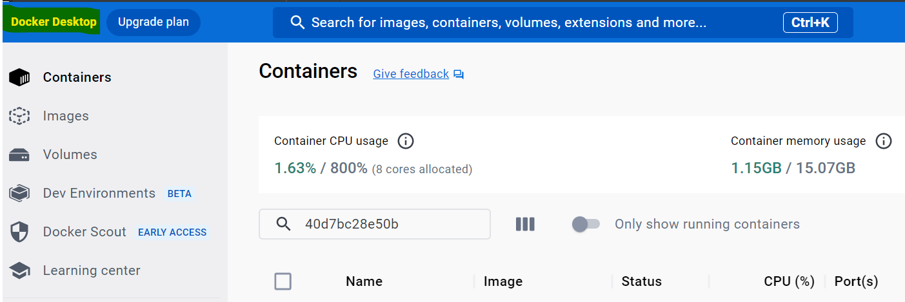

    Novo teste, agora com o ambiente inicialidado pelo docker-compose.yml

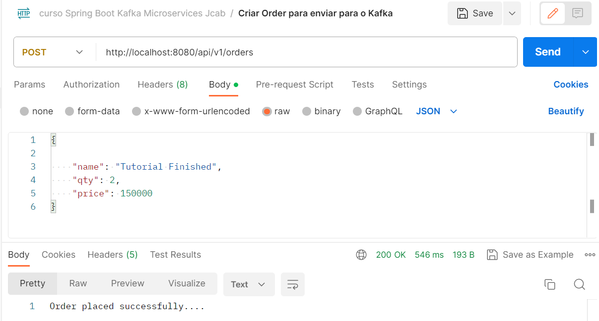

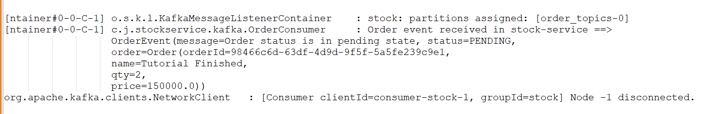

## **MELHORIA - GRAVANDO A ORDER NO MONGODB**

    ALTERAÇÕES NO STOCK-SERVICE

**Colocando a dependência do mongoDB no arquivo POM.XML**

            <dependency>
                <groupId>org.springframework.boot</groupId>
                <artifactId>spring-boot-starter-data-mongodb</artifactId>
                <version>2.7.0</version>
            </dependency>

**Configurando o acesso ao mongoDB no application.properties**

       spring.data.mongodb.uri=mongodb://localhost:27017/order-service

**Configuração no DOCKER-COMPOSE ( Vou colocar o arquivo copleto aqui )**

        version: "3.0"

        services:
        
        zookeeper:
        image: confluentinc/cp-zookeeper:5.1.2
        restart: always
        environment:
        ZOOKEEPER_SERVER_ID: 1
        ZOOKEEPER_CLIENT_PORT: "2181"
        ZOOKEEPER_TICK_TIME: "2000"
        ZOOKEEPER_SERVERS: "zookeeper:22888:23888"
        ports:
        - "2181:2181"
        networks:
          - jcaboclo-network
        
        kafka1:
        image: confluentinc/cp-enterprise-kafka:5.1.2
        depends_on:
        - zookeeper
        ports:
          - "29092:29092"
          environment:
          KAFKA_ZOOKEEPER_CONNECT: "zookeeper:2181"
          KAFKA_LISTENER_SECURITY_PROTOCOL_MAP: PLAINTEXT:PLAINTEXT,PLAINTEXT_HOST:PLAINTEXT
          KAFKA_INTER_BROKER_LISTENER_NAME: PLAINTEXT
          KAFKA_ADVERTISED_LISTENERS: PLAINTEXT://kafka1:9092,PLAINTEXT_HOST://localhost:29092
          KAFKA_ADVERTISED_HOST_NAME: kafka1
          KAFKA_BROKER_ID: 1
          KAFKA_BROKER_RACK: "r1"
          KAFKA_OFFSETS_TOPIC_REPLICATION_FACTOR: 1
          KAFKA_DELETE_TOPIC_ENABLE: "true"
          KAFKA_AUTO_CREATE_TOPICS_ENABLE: "true"
          KAFKA_SCHEMA_REGISTRY_URL: "schemaregistry:8085"
          KAFKA_JMX_PORT: 9991
          networks:
          - jcaboclo-network
        
        kafdrop:
        image: obsidiandynamics/kafdrop
        restart: "no"
        ports:
        - "9000:9000"
        environment:
        KAFKA_BROKERCONNECT: "kafka1:29092"
        depends_on:
          - kafka1
          networks:
          - jcaboclo-network
        
        mongo-express:
        image: mongo-express
        ports:
        - 8787:8787
        environment:
        ME_CONFIG_BASICAUTH_USERNAME: renatogroffe
        ME_CONFIG_BASICAUTH_PASSWORD: MongoExpress2019!
        ME_CONFIG_MONGODB_PORT: 27017
        ME_CONFIG_MONGODB_ADMINUSERNAME: root
        ME_CONFIG_MONGODB_ADMINPASSWORD: MongoDB2019!
        links:
          - mongo
          networks:
          - jcaboclo-network
        
        mongo:
        image: mongo
        environment:
        MONGO_INITDB_ROOT_USERNAME: root
        MONGO_INITDB_ROOT_PASSWORD: MongoDB2019!
        ports:
        - "27017:27017"
        volumes:
          - /home/renatogroffe/Desenvolvimento/Docker/Volumes/MongoDB:/data/db
          networks:
          - jcaboclo-network
        
        networks:
        jcaboclo-network:
        
        volumes:
        zookeeper_data:
        driver: local
        kafka_data:
        driver: bridge

**Agora iremos criar a Repositório e a interface para acessar os dados**

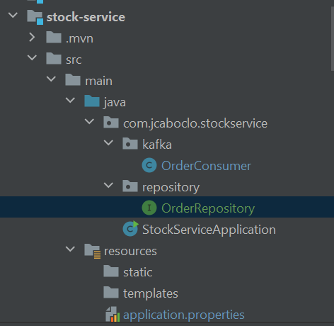

    **A interface OrderRepository  para permitir acesso ao banco de dados mongoDB**

    package com.jcaboclo.stockservice.repository;
    
    import com.jcaboclo.basedomains.dto.Order;
    import org.springframework.data.mongodb.repository.MongoRepository;
    
    public interface OrderRepository extends MongoRepository<Order, String>{
    }

    **Agora, finalmente, iremos ajustar a class consumidora para além de receber o evento, 
      salvar o objeto ORDER no mongoDB**

     Este ajuste será feito na class OrderConsumer

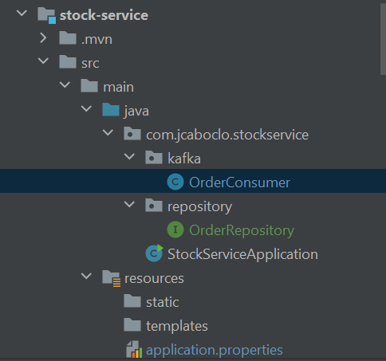

**A Class OrderConsumer**

    package com.jcaboclo.stockservice.kafka;
    
    import com.jcaboclo.basedomains.dto.OrderEvent;
    import com.jcaboclo.stockservice.repository.OrderRepository;
    import org.slf4j.Logger;
    import org.slf4j.LoggerFactory;
    import org.springframework.kafka.annotation.KafkaListener;
    import org.springframework.stereotype.Service;
    @Service
    public class OrderConsumer {
    
        private final OrderRepository orderRepository;
    
        private static final Logger LOGGER = LoggerFactory.getLogger(OrderConsumer.class);
    
        public OrderConsumer(OrderRepository orderRepository) {
            this.orderRepository = orderRepository;
        }
    
        @KafkaListener(
                topics = "${spring.kafka.topic.name}",
                groupId = "${spring.kafka.consumer.group-id}"
        )
        public void consume(OrderEvent event) {
            LOGGER.info(String.format("Order event received in stock-service ==> %s", event.toString()));
    
            // todo
            //   Save the order event into the database
            orderRepository.save(event.getOrder());
        }
    }

**Testando pelo POSTMAN**
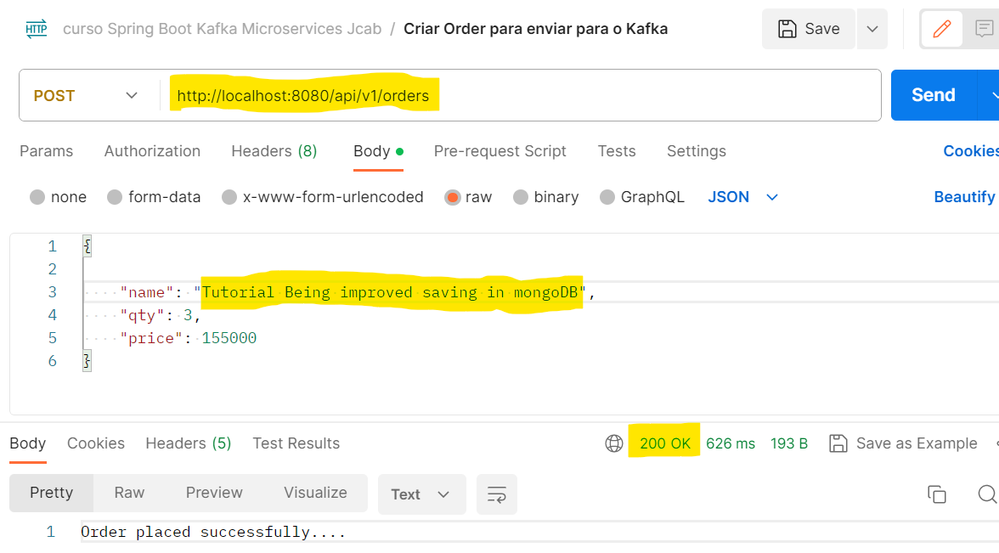

Consultando no mongoDB
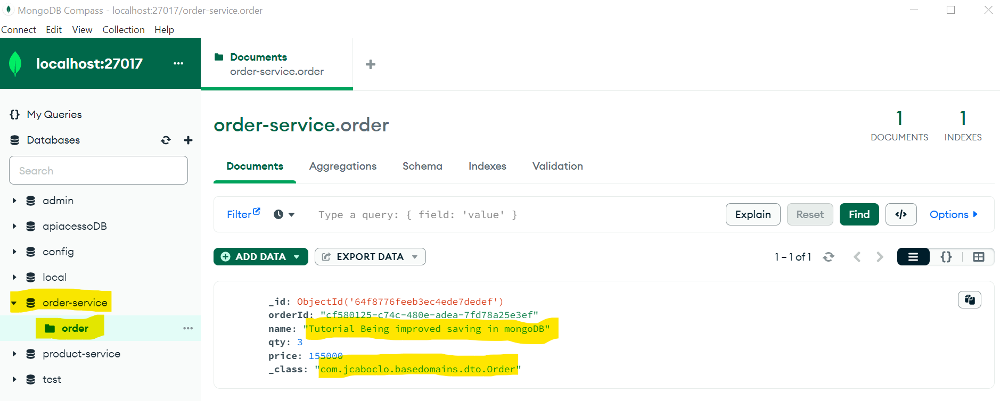

## MELHORIA:  Implementando a camada de BFF

       Atualizar o arquivo application.properties para adicionar a URL 
       do micro serviço ORDER-SERVICE

        spring.kafka.producer.bootstrap-servers=localhost:29092
        spring.kafka.producer.key-serializer=org.apache.kafka.common.serialization.StringSerializer
        spring.kafka.producer.value-serializer=org.springframework.kafka.support.serializer.JsonSerializer
        spring.kafka.topic.name=order_topics
        
        spring.data.mongodb.uri=mongodb://localhost:27017/order-service
        backend.order-api.url = ${variable.url:http://localhost:8080/api/v1/orders}

    **Incialmente, criamos um pacote chamado bff. A estrutura está como na figura abaixo**

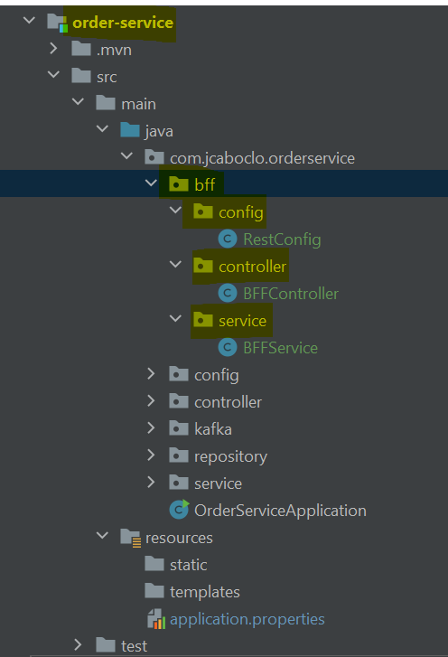

        A Classe RestConfig serve apenas para criar um RestTemplate que nos permitirá
        chamar os métodos nos micro serviços

        package com.jcaboclo.orderservice.bff.config;
        
        import org.springframework.context.annotation.Bean;
        import org.springframework.context.annotation.Configuration;
        import org.springframework.web.client.RestTemplate;
        
        @Configuration
        public class RestConfig {
        
            @Bean
            public RestTemplate restTemplate() {
                return new RestTemplate();
            }
        
        }

        A Classe BFFController - Irá recebar a requisição externa
        seja do postman, de app angular, ou qualquer outro  que seja 
       
        /api/v1/dadosorder (  http://localhost:8080/api/v1/dadosorder  )

           Coloquei "dadosorder" porque a ideia é que todas as informações
           necessários ou referentes a tela de geração de "orders" deverão
           ser retornadas em um objetos agregando todas as informações da tela.
         
           Então: Se para isto, for preciso pegar informações em vários micros
           serviços, isto será feito, e as informações serão agrupado no objeto
           que será retornado para o aplicativo que fez o request.

        package com.jcaboclo.orderservice.bff.controller;
        
        import com.jcaboclo.basedomains.dto.Order;
        import com.jcaboclo.orderservice.bff.service.BFFService;
        import org.springframework.web.bind.annotation.GetMapping;
        import org.springframework.web.bind.annotation.RequestMapping;
        import org.springframework.web.bind.annotation.RestController;
        import java.util.List;
        
        @RestController
        @RequestMapping("/api/v1/dadosorder")
        public class BFFController {
        
            private final BFFService bffService;
            public BFFController(BFFService bffService) {
                this.bffService = bffService;
            }
        
            @GetMapping
            public List<Order> listarOrders() {
                return bffService.listarOrders();
            }
        }

        A CLASSE BFFService
        
        package com.jcaboclo.orderservice.bff.service;
        
        import com.jcaboclo.basedomains.dto.Order;
        import org.slf4j.Logger;
        import org.slf4j.LoggerFactory;
        import org.springframework.beans.factory.annotation.Autowired;
        import org.springframework.stereotype.Service;
        import org.springframework.web.bind.annotation.GetMapping;
        import org.springframework.web.client.RestTemplate;
        
        import java.util.List;
        
        @Service
        public class BFFService {
        
            private static final Logger LOGGER = LoggerFactory.getLogger(BFFService.class);
            @Autowired
            private RestTemplate restTemplate;
            
            // Não faça desta maneira.  Defina a variável no application.properties
            //      private final String backendServiceUrl = "http://localhost:8080/api/v1/orders";
        
            //  Maneira correta segundo as boas práticas
            //  só lembrando:  Esta variável foi definida no arquivo application.properties
            //  neste formato:
                        backend.order-api.url = ${variable.url:http://localhost:8080/api/v1/orders}
            
            //  Usando a variável
            @Value("${backend.order-api.url}")
            private String backendServiceUrl;

            @GetMapping
            public List<Order> listarOrders() {
                List<Order> orders =  restTemplate.getForObject(backendServiceUrl,List.class);
                LOGGER.info(String.format("List of orders ==> %s", orders.stream().toList()));
                return orders;
            }
        }

**Testando no POSTMAN**

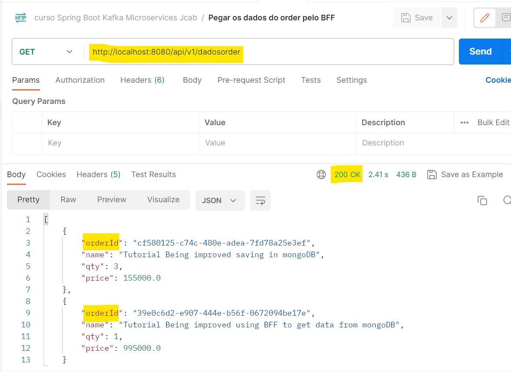

**Conferindo no log do intellij**

2023-09-07T10:49:00.067-03:00  INFO 23180 --- [nio-8080-exec-8] 
     c.j.orderservice.bff.service.BFFService  : 
       List of orders ==> [{orderId=cf580125-c74c-480e-adea-7fd78a25e3ef, 
                              name=Tutorial Being improved saving in mongoDB, 
                              qty=3, 
                              price=155000.0}, 
                           {orderId=39e0c6d2-e907-444e-b56f-0672094be17e, 
                              name=Tutorial Being improved using BFF to get data from mongoDB, 
                              qty=1, 
                              price=995000.0}]

Finalizando por aqui

